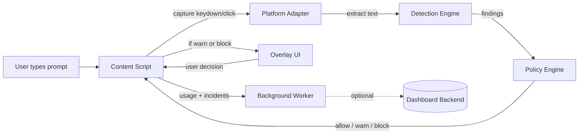

# Architecture

## Overview

AI Compliance Copilot is a browser extension that intercepts prompts before they leave the user's browser, runs them through a local detection engine, and blocks, warns, or allows them based on configurable policies.

## Components

### Browser Extension (`apps/extension`)

| File                                                                       | Role                                                                           |
| -------------------------------------------------------------------------- | ------------------------------------------------------------------------------ |
| [src/background.ts](../apps/extension/src/background.ts)                   | Service worker. Messaging, config caching (5-min TTL), optional backend calls. |
| [src/content.ts](../apps/extension/src/content.ts)                         | Content script. Loads the right adapter per hostname, runs detection on send.  |
| [src/adapters/base.ts](../apps/extension/src/adapters/base.ts)             | Base class. Capture-phase listeners for `keydown` and button `click`.          |
| [src/adapters/chatgpt.ts](../apps/extension/src/adapters/chatgpt.ts)       | ChatGPT (chatgpt.com, chat.openai.com)                                         |
| [src/adapters/claude.ts](../apps/extension/src/adapters/claude.ts)         | Claude (claude.ai)                                                             |
| [src/adapters/gemini.ts](../apps/extension/src/adapters/gemini.ts)         | Google Gemini                                                                  |
| [src/adapters/perplexity.ts](../apps/extension/src/adapters/perplexity.ts) | Perplexity                                                                     |
| [src/overlay/overlay.ts](../apps/extension/src/overlay/overlay.ts)         | Modal for warn/block, offers redacted-send.                                    |
| [src/popup/popup.ts](../apps/extension/src/popup/popup.ts)                 | Toolbar popup: session stats, prompt library.                                  |

### Shared Packages

- [packages/detection-engine](../packages/detection-engine) — pattern + contextual rules, confidence scoring.
- [packages/policy-engine](../packages/policy-engine) — matches findings against policies, resolves conflicts (block > warn > allow).
- [packages/shared-types](../packages/shared-types) — TypeScript contracts shared across all packages.

## Adding a new LLM platform

1. Create `apps/extension/src/adapters/<platform>.ts` extending `BaseAdapter`.
2. Implement `getInput()`, `getSendButton()`, `getText()`, `setText()` for the site's DOM.
3. Register the hostname → adapter mapping in [content.ts](../apps/extension/src/content.ts).
4. Add the host to `host_permissions` in [manifest.json](../apps/extension/public/manifest.json).
5. Add tests and a fixture prompt.

## Backend coupling

The extension works standalone. If `authToken` and `organizationId` are set in `chrome.storage.local`, the background worker:

- fetches org policies + custom patterns from the dashboard,
- POSTs usage events and incidents,
- queues events in `pendingIncidents` if offline.

No prompt content ever leaves the browser unless the user explicitly sends it or the dashboard is configured with incident-preview enabled.
